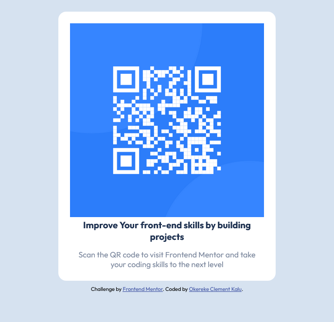

# Frontend Mentor - QR code component solution

This is a solution to the [QR code component challenge on Frontend Mentor](https://www.frontendmentor.io/challenges/qr-code-component-iux_sIO_H). Frontend Mentor challenges help you improve your coding skills by building realistic projects.

## Table of contents

- [Frontend Mentor - QR code component solution](#frontend-mentor---qr-code-component-solution)
  - [Table of contents](#table-of-contents)
  - [Overview](#overview)
    - [Screenshot](#screenshot)
    - [Links](#links)
  - [My process](#my-process)
    - [Built with](#built-with)
    - [What I learned](#what-i-learned)
    - [Continued development](#continued-development)
  - [Author](#author)
  - [Acknowledgments](#acknowledgments)

**Note: Delete this note and update the table of contents based on what sections you keep.**

## Overview

### Screenshot

### Links

- Solution URL: [GitHub]([https://your-solution-url.com](https://github.com/inspikalu/qr-code-component-main/))
- Live Site URL: [Live Site Url](https://superlative-tulumba-f3a5f4.netlify.app/)

## My process

### Built with

- Semantic HTML5 markup
- CSS custom properties
- Flexbox
- Mobile-first workflow
- Sass

### What I learned

While building the project i got to practise some of the lessons i was taught on areas like flexbox, flexbox alignment properties, using SCSS variables, SCSS nesting etc.

### Continued development

I wish to further uses SCSS more in upcoming projects as it is time effective and helps write DRY(Don't Repeat Yourself) code

## Author

- Frontend Mentor - [@inspikalu](https://www.frontendmentor.io/profile/inspikalu)
- Twitter - [@inspikalu](https://twitter.com/inspikalu)
- Threads - [@inspikalu](https://threads.net/inspikalu)

## Acknowledgments

I want to use the medium to encourage everybody at the frontend mentor community even though i am just a begginer i feel welcomed especially from their Discord server.
